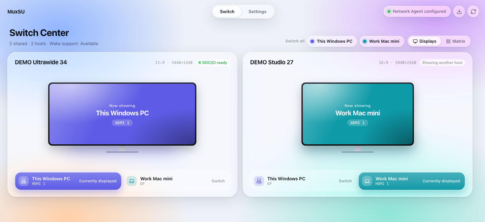
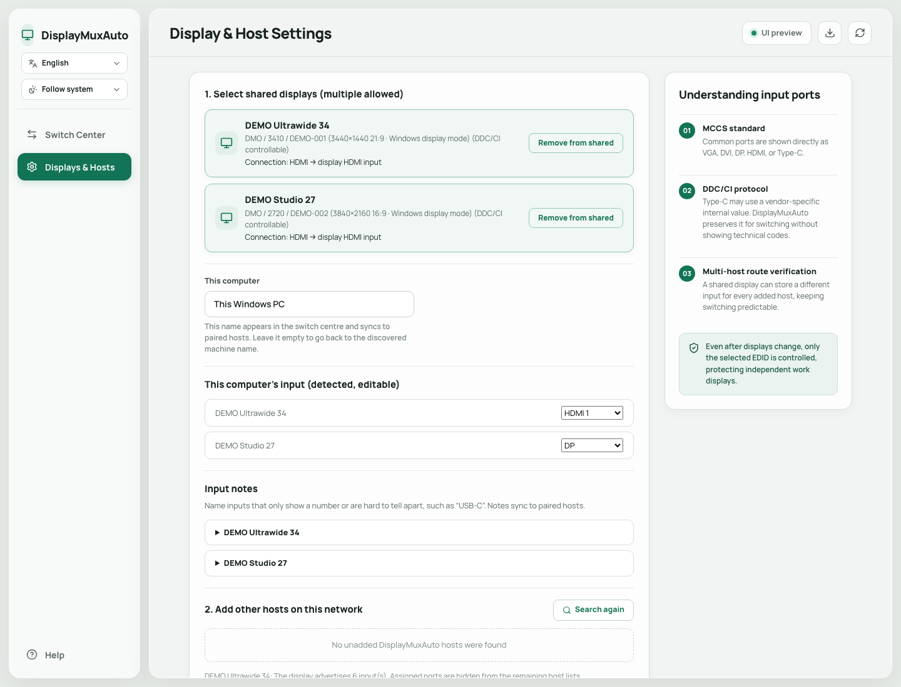

# DisplayMuxAuto

[繁體中文](README.md) | English

> DisplayMuxAuto extends [DisplayMux](https://github.com/HenryHsu/DisplayMux) by Henry Hsu, under the MIT licence.
> The original switches one shared monitor between two computers; this project builds on it so the two hosts work
> out each other's ports, display identities and settings between themselves, leaving less to be entered by hand.
> Release history before v0.1.6 points at the original project.

DisplayMuxAuto is a desktop utility for Windows 10/11 and macOS 12+ that lets multiple computers share a single monitor. It switches the monitor input directly from your computer, so you do not need to reach for the monitor's physical controls.

It controls only the shared monitor you select. It does not change your operating system's display arrangement or switch any of your other work displays.

## When DisplayMux Is Useful

For example, you may have:

- One shared monitor connected to two computers
- Other dedicated monitors that do not need to be switched (optional)

DisplayMux switches only the selected shared monitor. Your other displays keep their existing content and arrangement.

A shared monitor can also be used by multiple Windows PCs or Macs. DisplayMux saves the input port used by each host.

## What's New in v0.1.3

- After you select the shared monitor, DisplayMux automatically detects and saves the input port currently used by this computer.
- It reads the monitor's advertised inputs and lists only supported ports that have not already been assigned.
- When you add another configured DisplayMux host, its port is filled in automatically if pairing succeeds and both computers use the same shared monitor.
- Input menus now use familiar names: VGA, DVI, DP, HDMI 1, HDMI 2, and Type-C.
- Technical VCP values are no longer shown in the standard user interface.
- Input detection only reads monitor information. It does not cycle through ports, so detection does not cause the screen to go black.

## Screenshots

### Switch Center

After setup, you can see the monitor input assigned to each computer and switch to a target host from Switch Center.



### Display and Host Settings

DisplayMux detects the local computer's port automatically. When you add a configured host, it also fills in that host's port after successful verification. The names, addresses, and monitor details shown below are anonymized demonstration data.



## Before You Begin

Make sure that:

1. The shared monitor supports DDC/CI.
2. DDC/CI is enabled in the monitor's on-screen display (OSD) settings.
3. DisplayMux is installed and running on every computer that will participate in switching.
4. The computers you want to pair are on the same private local network.
5. Every computer uses the same pairing password of at least eight characters.

A working video signal does not necessarily mean that the cable, adapter, or dock also forwards DDC/CI. If DisplayMux cannot detect the monitor, see [Connection and Compatibility Limitations](#connection-and-compatibility-limitations).

## Quick Setup

### 1. Select the Shared Monitor

Open the Display and Host Settings page and refresh the monitor list:

- If only one controllable external monitor is available, DisplayMux selects it automatically.
- If multiple controllable monitors are available, select the one you want to share.

DisplayMux identifies the target by its manufacturer, model, and serial number. It does not guess based on the **primary display** setting or display arrangement.

### 2. Confirm the Local Port

After you select a monitor, DisplayMux immediately reads its current input and automatically saves the port used by this computer. Manual setup is normally unnecessary.

The interface displays familiar names such as VGA, DVI, DP, HDMI, and Type-C, so you do not need to look up technical codes.

### 3. Set a Pairing Password

Enter exactly the same pairing password on every computer. The password must contain at least eight characters and is used to authenticate control requests on the local network, including requests associated with waking a computer.

### 4. Add Other Hosts

Find another computer under Nearby DisplayMux Hosts, then select Add.

If that computer has already configured its shared monitor, DisplayMux automatically fills in its port when all of the following conditions are met:

- The pairing password is verified successfully
- Both computers selected exactly the same monitor identity
- The other computer's port is a supported input on this monitor
- The port has not been assigned to the local computer or another host
- Both computers are running v0.1.3 or later

If DisplayMux cannot verify the port safely, it leaves the manual selection in place instead of guessing where the other computer is connected.

### 5. Save and Repeat on the Other Computers

Save the settings, then repeat these steps on every computer that participates in switching. Enabling Start at Login is recommended so other hosts can discover and wake this computer and ask it to assist with switching.

## Everyday Use

After setup, choose the target computer in Switch Center.

When switching to a remote host, DisplayMux:

1. Attempts to wake the target host using Wake-on-LAN.
2. Checks whether the target host's DisplayMux Agent is ready.
3. First attempts to switch the shared monitor through DDC/CI from the current computer.
4. If the local DDC/CI path fails, asks the verified remote host to perform the switch.

If the network Agent is temporarily unavailable, DisplayMux still attempts to use local DDC/CI. The monitor may briefly show a black screen if the target computer is not yet producing a video signal.

On Windows, closing or minimizing the window leaves DisplayMux running in the system tray. The application exits only when you select Exit DisplayMux from the tray menu.

## Input Port List

DisplayMux prefers the input list advertised by the monitor and excludes ports that have already been assigned.

If the monitor, hub, dock, or adapter cannot provide that list, the interface falls back to a compact set of common options:

- VGA
- DVI
- DP
- HDMI 1
- HDMI 2
- Type-C

Some monitors use vendor-specific values for Type-C or other inputs. DisplayMux retains the raw value reported by the monitor for internal switching, but displays Other Input when the name cannot be identified reliably.

After changing the monitor, cable, dock, or physical connection port, select the shared monitor again and review the configuration on every host.

## Monitor Not Found or Unable to Switch

Check the following in order:

1. DDC/CI is enabled in the monitor's OSD settings.
2. You selected the external shared monitor rather than a laptop's built-in display.
3. Test a direct cable connection between the monitor and computer.
4. Temporarily remove any KVM, adapter, or dock to identify whether an intermediate device is causing the problem.
5. Refresh the DisplayMux monitor and host lists.
6. Confirm that both computers use the same pairing password and have correct system clocks.
7. Confirm that the firewall allows mDNS and the DisplayMux Agent on private networks.

If a direct connection works but a dock provides video only, the dock or its driver is probably not forwarding DDC/CI. Pairing again cannot restore a hardware control path that is not present.

## Connection and Compatibility Limitations

### Windows

On Windows, DisplayMux uses the system DDC/CI interface to enumerate and control physical monitors. Only monitors whose current input can actually be read appear in the selection list.

### macOS

DDC/CI availability on macOS depends on the Mac model, macOS version, port, cable, adapter, and whether a dock forwards the complete control signal.

Connections that are more likely to work include:

- A direct connection to the built-in HDMI port on a Mac mini
- A direct Thunderbolt-to-DisplayPort connection
- A Thunderbolt-to-HDMI connection

The following devices may carry video without exposing DDC/CI to third-party applications:

- Some MST docks
- DisplayLink docks
- Silicon Motion InstantView, SM76x, or SM77x devices
- HDMI or USB-C adapters that do not fully forward DDC

The ability to adjust brightness through DisplayLink or a dock vendor's own software does not mean that DisplayMux can access the physical monitor's control channel.

## Wake-on-LAN and Networking

- mDNS uses `5353/UDP` to discover DisplayMux hosts on the same local network.
- The DisplayMux Agent uses `47653/TCP` by default.
- On macOS, you can enable Wake for network access.
- On Windows, you can enable Wake-on-LAN in the network adapter and BIOS/UEFI settings.
- Wake behavior after a complete shutdown depends on the computer's hardware, firmware, and operating system and cannot be guaranteed by DisplayMux.

IP addresses, MAC addresses, and Agent ports are discovered and saved automatically. Search again to update the information after a DHCP address changes.

## Security and Privacy

- DisplayMux controls only the unique target whose complete monitor identity matches the saved configuration.
- The operation stops if the target is missing, required identity information is unavailable, or multiple matching monitors are found.
- Paired hosts authenticate control requests using HMAC-SHA256, time limits, and nonce replay protection.
- Pairing passwords are not written to normal operation logs.
- Wake-on-LAN packets are used only for waking and do not authorize a monitor switch by themselves.
- mDNS broadcasts only the information needed for host discovery on the local network.
- Update checks do not transmit pairing passwords, monitor settings, computer names, private network addresses, or monitor identity information.

## Installation and Updates

Download the Windows installer or macOS Universal DMG from a trusted DisplayMux GitHub Release.

DisplayMux can check GitHub Releases for newer versions, but it does not download or install an update without confirmation. After the user chooses to install an update, the application verifies the update package signature first.

### macOS Gatekeeper

The current macOS DMG uses an ad-hoc signature and has not yet been signed and notarized with an Apple Developer ID. Gatekeeper may require manual approval the first time you launch DisplayMux:

1. Drag `DisplayMux.app` into `/Applications` and try to open it once.
2. Open System Settings > Privacy & Security.
3. Find DisplayMux in the Security section and select Open Anyway.
4. Authenticate and confirm again.

Allow the application to run only after confirming that it came from a trusted Release for this project. See Apple's [Open apps safely on your Mac](https://support.apple.com/102445) for more information.

## Development and Building

Development requirements: Rust 1.85+, Node.js 22+, and pnpm 10+. Building on macOS also requires the Xcode Command Line Tools.

```powershell
pnpm install --frozen-lockfile
pnpm tauri dev
```

Run the complete verification suite:

```powershell
pnpm build
cargo test --workspace
cargo fmt --all -- --check
cargo clippy --workspace --all-targets -- -D warnings
```

Create release installers:

```powershell
pnpm tauri build
```

On macOS, use the dedicated script to create an ad-hoc-signed Universal DMG:

```bash
./scripts/build-macos-dmg.sh
```

Artifacts are written to `target/release/bundle/`. Windows produces an NSIS installer by default; macOS produces an `.app` bundle and a `.dmg`.

### CLI Diagnostics

The CLI is intended for developers diagnosing monitor identity and switching. It is not required for normal use:

```powershell
cargo run -p displaymux-cli -- list
cargo run -p displaymux-cli -- switch <manufacturer> <product> <serial|-> <input> --dry-run
```

Remove `--dry-run` to perform an actual switch only after confirming that the target is correct.

## License

DisplayMux is available under the [MIT License](LICENSE).
