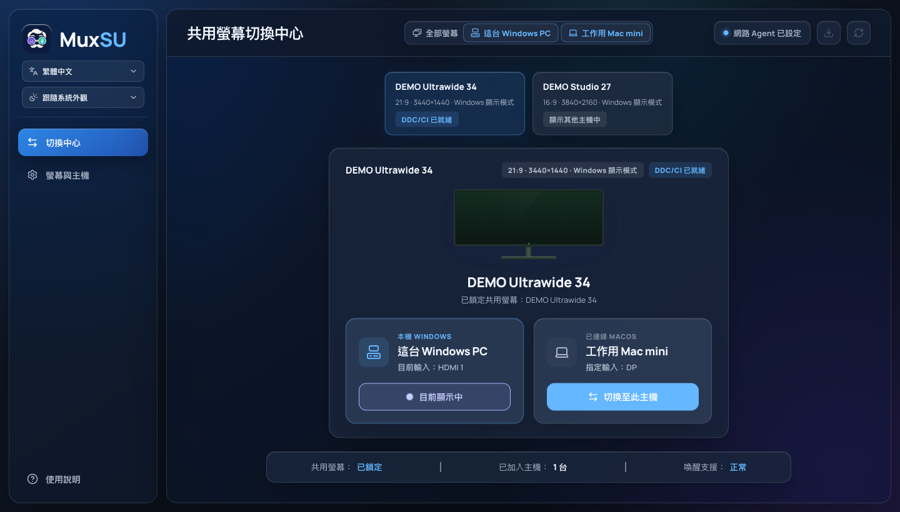
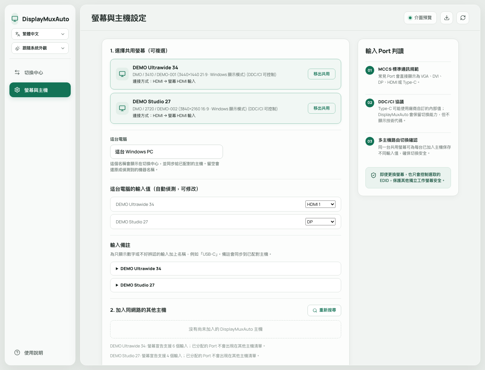

# DisplayMuxAuto

繁體中文 | [English](README.en.md)

> DisplayMuxAuto 是 [DisplayMux](https://github.com/HenryHsu/DisplayMux)（作者 Henry Hsu，MIT 授權）的延伸開發版本。
> 原專案負責把一台共用螢幕在兩台電腦之間切換；本專案在其基礎上，讓兩台主機自動協調彼此的接口、螢幕身分與設定，
> 減少手動輸入。v0.1.6 以前的版本紀錄指向原專案。

DisplayMuxAuto 是一款適用於 Windows 10／11 與 macOS 12+ 的桌面工具，讓多台電腦共用同一台螢幕時，可以直接從電腦切換螢幕輸入，不必伸手操作螢幕按鍵。

它只控制你選定的共用螢幕，不會改變作業系統的螢幕排列，也不會切換其他工作螢幕。

## 適合的使用情境

例如你有：
- 一台同時連接兩台電腦的共用螢幕
- 其他不需要切換的專用螢幕(非必要)

DisplayMux 只會切換指定的共用螢幕。其他螢幕會保持原本的畫面與排列。
一台共用螢幕也可以加入多台 Windows 或 Mac；每台主機會保存各自使用的輸入 Port。

## v0.1.3 重點更新

- 選擇共用螢幕後，自動偵測並保存這台電腦目前使用的輸入 Port。
- 自動讀取螢幕提供的輸入資訊，只列出受支援且尚未分配的 Port。
- 加入另一台已設定好的 DisplayMux 主機時，若配對驗證成功且雙方使用同一台共用螢幕，會自動帶入對方的 Port。
- 輸入選單改用容易理解的名稱：VGA、DVI、DP、HDMI 1、HDMI 2、Type-C。
- 不再於一般操作介面顯示難以理解的 VCP 技術數值。
- 輸入偵測只會讀取螢幕資訊，不會逐一切換 Port，因此不會為了偵測而造成黑畫面。

## 實際操作畫面

### 切換中心

設定完成後，可以直接看到每台電腦對應的螢幕輸入，並從切換中心切換至目標主機。



### 螢幕與主機設定

DisplayMux 會自動判讀本機 Port；加入已設定好的主機後，也會在驗證成功時自動帶入對方的 Port。畫面中的名稱、位址與螢幕資訊皆為匿名展示資料。




## 使用前準備

開始前請確認：

1. 共用螢幕支援 DDC/CI。
2. 已在螢幕的 OSD 設定中開啟 DDC/CI。
3. 每台要參與切換的電腦都已安裝並啟動 DisplayMux。
4. 要互相配對的電腦位於同一個私人區域網路。
5. 每台電腦都設定完全相同、至少 8 個字元的配對密碼。

螢幕能正常顯示畫面，不一定代表目前使用的線材、轉接器或 Dock 也有轉送 DDC/CI。若偵測不到螢幕，請先參考下方的[連接與相容性限制](#連接與相容性限制)。

## 快速設定

### 1. 選擇共用螢幕

開啟「螢幕與主機」設定頁並重新整理螢幕清單：

- 只有一台可控制的外接螢幕時，DisplayMux 會自動選取。
- 有多台可控制螢幕時，請手動選擇要共用的那一台。

DisplayMux 會使用螢幕的製造商、型號與序號鎖定目標，不會依照**主螢幕**或螢幕排列順序猜測。

### 2. 確認本機 Port

選擇螢幕後，DisplayMux 會立即讀取目前輸入，並自動保存這台電腦使用的 Port。一般情況下不需要手動設定。

介面會直接顯示 VGA、DVI、DP、HDMI 或 Type-C 等名稱，不需要查詢技術代碼。

### 3. 設定配對密碼

在所有電腦輸入完全相同的配對密碼。密碼至少需要 8 個字元，用來驗證區域網路內的控制要求，用於**喚醒電腦**。

### 4. 加入其他主機

在「附近的 DisplayMux 主機」中找到另一台電腦，然後按下「加入」。

如果對方已完成共用螢幕設定，DisplayMux 會在下列條件全部成立時自動填入它使用的 Port：

- 配對密碼驗證成功
- 雙方選擇的螢幕識別資訊完全一致
- 對方的 Port 是這台螢幕可使用的輸入
- 該 Port 尚未分配給本機或其他主機
- 雙方都使用 v0.1.3 或更新版本

若無法安全確認，介面會保留手動選擇，不會猜測另一台電腦接在哪個 Port。

### 5. 儲存並在其他電腦重複設定

儲存設定後，在其他參與切換的電腦上完成相同步驟。建議開啟「登入後自動啟動」，讓其他主機可以搜尋、喚醒並要求這台電腦協助切換。

## 日常使用

設定完成後，在「切換中心」選擇目標主機即可。

切換至遠端主機時，DisplayMux 會：

1. 嘗試透過 Wake-on-LAN 喚醒目標主機。
2. 確認目標主機的 DisplayMux Agent 是否就緒。
3. 優先從目前這台電腦透過 DDC/CI 切換共用螢幕。
4. 如果本機 DDC/CI 路徑失敗，再嘗試請已驗證的遠端主機代為切換。

網路 Agent 暫時無法連線時，DisplayMux 仍會嘗試使用本機 DDC/CI。若目標電腦尚未輸出畫面，螢幕可能短暫顯示黑畫面。

Windows 版關閉或最小化視窗後會留在系統匣執行。只有從系統匣選擇「結束 DisplayMux」才會真正關閉程式。

## 輸入 Port 清單

DisplayMux 優先使用螢幕自行提供的輸入清單，並排除已經分配的 Port。

若螢幕、HUB、Dock 或轉接器無法提供清單，介面會改用精簡的常見選項：

- VGA
- DVI
- DP
- HDMI 1
- HDMI 2
- Type-C

部分螢幕會使用廠商自訂的 Type-C 或其他輸入值。DisplayMux 會保留螢幕回報的原始值供內部切換，但無法確定名稱時只會顯示「其他輸入」，避免錯誤標示。

更換螢幕、線材、Dock 或實際連接 Port 後，請重新選擇共用螢幕並檢查每台主機的設定。

## 找不到螢幕或無法切換

請依序確認：

1. 螢幕 OSD 中的 DDC/CI 已開啟。
2. 目前選擇的是外接共用螢幕，而不是筆電內建螢幕。
3. 改用螢幕與電腦之間的直連線材測試。
4. 暫時移除 KVM、轉接器或 Dock，確認問題是否位於中間設備。
5. 重新整理 DisplayMux 的螢幕與主機清單。
6. 確認兩台電腦使用相同配對密碼，且系統時間正確。
7. 確認防火牆允許私人網路上的 mDNS 與 DisplayMux Agent。

若直連可以控制、經過 Dock 後只能顯示畫面，通常表示 Dock 或驅動程式沒有轉送 DDC/CI；重新配對無法補回不存在的硬體通道。

## 連接與相容性限制

### Windows

Windows 透過系統的 DDC/CI 介面列舉與控制實體螢幕。只有能實際讀取目前輸入的螢幕才會出現在可選清單。

### macOS

macOS 是否能使用 DDC/CI，取決於 Mac 型號、macOS 版本、連接埠、線材、轉接器與 Dock 是否完整轉送訊號。

通常較有機會正常運作的連接方式包括：

- Mac mini 內建 HDMI 直連
- Thunderbolt 至 DisplayPort 直連
- Thunderbolt 轉 HDMI

以下裝置可能只能輸出畫面，卻不提供第三方程式可使用的 DDC/CI：

- 部分 MST Dock
- DisplayLink Dock
- Silicon Motion InstantView／SM76x／SM77x 裝置
- 未完整轉送 DDC 的 HDMI 或 USB-C 轉接器

DisplayLink 或 Dock 自己的軟體能調整亮度，不代表 DisplayMux 也能取得實體螢幕的控制通道。

## Wake-on-LAN 與網路

- mDNS 使用 `5353/UDP` 搜尋同一區域網路內的 DisplayMux 主機。
- DisplayMux Agent 預設使用 `47653/TCP`。
- macOS 可開啟「Wake for network access」。
- Windows 可在網卡與 BIOS／UEFI 中啟用 Wake-on-LAN。
- 完整關機後能否喚醒取決於電腦硬體、韌體與作業系統設定，DisplayMux 無法保證。

IP、MAC 位址與 Agent Port 會在搜尋主機時自動取得並保存。DHCP 位址改變後，再次搜尋即可更新資料。

## 安全與隱私

- DisplayMux 只會控制完整螢幕識別資訊相符的唯一目標。
- 找不到目標、缺少必要識別資訊或同時出現多台相符螢幕時，操作會停止。
- 已配對主機之間使用 HMAC-SHA256、時間限制與 nonce 重播防護驗證控制要求。
- 配對密碼不會寫入一般操作日誌。
- Wake-on-LAN 封包只用於喚醒，不會直接授權螢幕切換。
- mDNS 只在區域網路廣播主機搜尋所需資訊。
- 更新檢查不會傳送配對密碼、螢幕設定、電腦名稱、內網位址或螢幕識別資訊。

## 安裝與更新

請從可信任的 DisplayMux GitHub Release 下載 Windows 安裝程式或 macOS Universal DMG。

DisplayMux 可以檢查 GitHub Releases 是否有新版本，但不會在未確認的情況下自動下載或安裝。使用者選擇安裝後，程式會先驗證更新套件簽章。

### macOS Gatekeeper

目前 macOS DMG 使用 ad-hoc 簽章，尚未透過 Apple Developer ID 正式簽章與公證。第一次啟動時，Gatekeeper 可能要求手動允許：

1. 將 `DisplayMux.app` 拖曳到 `/Applications`，並嘗試開啟一次。
2. 開啟「系統設定」→「隱私權與安全性」。
3. 在「安全性」區域找到 DisplayMux，按下「仍要打開」。
4. 完成身分驗證後再次確認。

只有在確認 App 來自本專案可信任的 Release 時才應允許執行。詳細說明可參考 Apple 的 [Open apps safely on your Mac](https://support.apple.com/102445)。

## 開發與建置

開發環境需求：Rust 1.85+、Node.js 22+、pnpm 10+。macOS 建置另需 Xcode Command Line Tools。

```powershell
pnpm install --frozen-lockfile
pnpm tauri dev
```

執行完整驗證：

```powershell
pnpm build
cargo test --workspace
cargo fmt --all -- --check
cargo clippy --workspace --all-targets -- -D warnings
```

建立正式安裝包：

```powershell
pnpm tauri build
```

macOS 可使用專用腳本建立 ad-hoc 簽章的 Universal DMG：

```bash
./scripts/build-macos-dmg.sh
```

產物位於 `target/release/bundle/`。Windows 預設產生 NSIS 安裝程式；macOS 產生 `.app` 與 `.dmg`。

### CLI 診斷

CLI 適合開發者診斷螢幕識別與切換，不是一般使用者必要流程：

```powershell
cargo run -p displaymux-cli -- list
cargo run -p displaymux-cli -- switch <manufacturer> <product> <serial|-> <input> --dry-run
```

確認目標正確後，才應移除 `--dry-run` 執行實際切換。

## 授權條款

DisplayMux 採用 [MIT License](LICENSE)。
